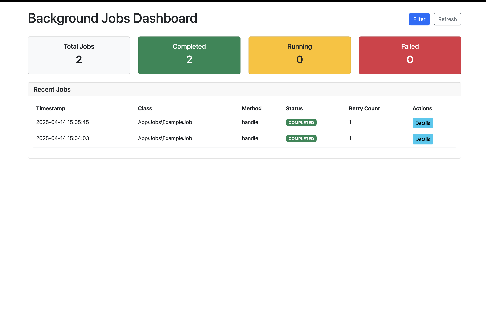

# Laravel Custom Background Job Runner

A custom background job execution system for Laravel, operating independently of Laravel's built-in queue system. This system provides a platform-independent way to run PHP classes as background jobs with support for error handling, retries, and comprehensive logging.



## Features

- ✅ Run PHP classes as background jobs via CLI
- ✅ Global helper function (`runBackgroundJob()`)
- ✅ Cross-platform support (Windows and Unix-based systems)
- ✅ Configurable retry mechanism for failed jobs
- ✅ Comprehensive logging system
- ✅ Security features to restrict which classes can be executed
- ✅ Web-based dashboard for monitoring job status
- ✅ Support for job priorities and delays (optional)

## Requirements

- PHP 8.1+
- Laravel 11.x
- Symfony Process component (recommended for better background processing)

## Installation

1. **Clone the repository**

```bash
git clone https://github.com/giftmothusi/laravel-background-jobs.git
cd laravel-background-jobs
```

2. **Install dependencies**

```bash
composer install
```

3. **Set up environment**

```bash
cp .env.example .env
php artisan key:generate
```

4. **Make the run-job.php script executable**

```bash
chmod +x run-job.php
```

5. **Create necessary directories (if they don't exist)**

```bash
mkdir -p storage/logs
```

## Configuration

1. **Configure allowed job classes**

Edit `config/background-jobs.php` to specify which classes and methods can run as background jobs:

```php
'allowed_jobs' => [
    App\Jobs\ExampleJob::class => ['handle', 'process'],
    // Add more jobs as needed
],
```

2. **Configure retry settings**

```php
'max_retries' => 3,
'retry_delay' => 5, // seconds
```

3. **Enable the dashboard (optional)**

```php
'enable_dashboard' => true,
```

## Usage

### Create Example Job Class

Create a sample job class to test the system:

```php
<?php

namespace App\Jobs;

class ExampleJob
{
    public function handle($param1 = null, $param2 = null)
    {
        \Illuminate\Support\Facades\Log::info("ExampleJob executed with params: " . json_encode([$param1, $param2]));
        return "Job completed with: " . $param1 . ", " . $param2;
    }
}
```

### Using the Helper Function

```php
// Basic usage
runBackgroundJob(\App\Jobs\ExampleJob::class, 'handle', ['param1', 'param2']);

// With delay (if enabled)
runBackgroundJob(\App\Jobs\ExampleJob::class, 'handle', ['param1', 'param2'], 0, 60); // 60 seconds delay

// With priority (if enabled, lower number = higher priority)
runBackgroundJob(\App\Jobs\ExampleJob::class, 'handle', ['param1', 'param2'], 1);
```

### Using the Artisan Command

```bash
# Basic usage
php artisan job:run "App\Jobs\ExampleJob" "handle" --params="param1,param2"

# With delay
php artisan job:run "App\Jobs\ExampleJob" "handle" --params="param1,param2" --delay=60

# With priority
php artisan job:run "App\Jobs\ExampleJob" "handle" --params="param1,param2" --priority=1
```

### Using the CLI Script Directly

```bash
php run-job.php "App\Jobs\ExampleJob" "handle" "param1,param2"
```

## Testing the Implementation

1. **Start Laravel development server**

```bash
php artisan serve
```

2. **Run a test job using the web route**

Visit `http://localhost:8000/test-background-job` in your browser.
You should see: "Background job dispatched. Check logs for results."

3. **Check logs to verify execution**

```bash
cat storage/logs/background_jobs.log
```

You should see entries like:
```
[2025-04-14 15:04:03] [RUNNING] [App\Jobs\ExampleJob::handle] Params: ["param1","param2"]
[2025-04-14 15:04:03] [COMPLETED] [App\Jobs\ExampleJob::handle] Params: ["param1","param2"]
```

4. **Test using Artisan command**

```bash
php artisan job:run "App\Jobs\ExampleJob" "handle" --params="test1,test2"
```

5. **Test using Tinker**

```bash
php artisan tinker
> runBackgroundJob(\App\Jobs\ExampleJob::class, 'handle', ['param1', 'param2']);
```

## Dashboard

The system includes a web-based dashboard for monitoring background jobs:


### Accessing the Dashboard

1. Make sure the dashboard is enabled in `config/background-jobs.php`:
   ```php
   'enable_dashboard' => true,
   ```

2. Visit `http://localhost:8000/background-jobs` in your browser

The dashboard provides:
- Statistics on job execution (total, completed, running, failed)
- A filterable table of recent jobs
- Job details with execution timeline
- Options to retry failed jobs

## Troubleshooting

### Job Not Running

- Verify the job class is registered in `config/background-jobs.php`
- Check that the class and method exist
- Ensure `run-job.php` is executable

### Web Routes Not Found

If you encounter 404 errors for the web routes:

```bash
php artisan route:clear
php artisan cache:clear
```

## Advanced Features

### Job Chaining

Chain jobs by calling `runBackgroundJob()` from within your job classes:

```php
public function handle($param)
{
    // Process first job
    // ...
    
    // Chain another job to run after this one
    runBackgroundJob(AnotherJob::class, 'handle', [$param]);
}
```

### Job Priorities

When priorities are enabled, jobs with lower priority values will be executed before those with higher values:

```php
// High priority job (runs first)
runBackgroundJob(CriticalJob::class, 'handle', $params, 1);

// Low priority job (runs later)
runBackgroundJob(NonCriticalJob::class, 'handle', $params, 10);
```

## License

This project is open-sourced software licensed under the [MIT license](https://opensource.org/licenses/MIT).
